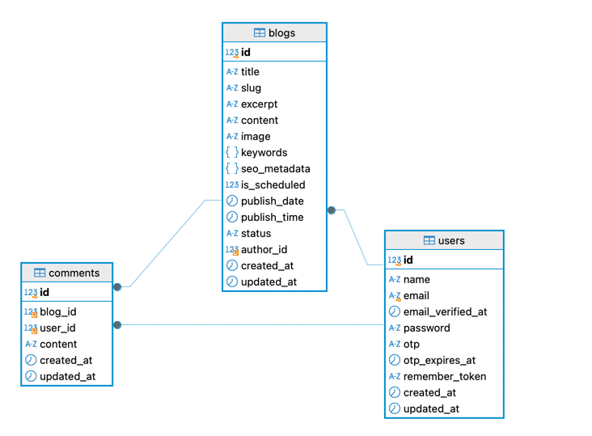

Project Setup Guide

This guide helps you get the frontend (website) and backend (API) up and running locally in a monorepo project.

## DB SCHEMA



## Redis Caching Strategy Implementation

In my project, I have implemented Redis as a caching layer to improve the performance and reduce the load on the
database. The strategy focuses on caching frequently accessed data and ensuring that data retrieval is faster.

- Data Cached: I cache data that is frequently accessed and doesn’t change often, such as product details, user
  profiles, or blog posts.
- Cache Miss and Hit: When data is requested, the system first checks if it’s available in the Redis cache (cache hit).
  If it’s not found (cache miss), the data is fetched from the database and stored in Redis for subsequent requests.
- TTL (Time to Live): I set a TTL on cache entries for automatic expiration after a certain time i.e, 5 Min. This
  ensures that outdated or stale data is removed from the cache and doesn’t stay in memory unnecessarily.
- Cache Invalidation: I use cache invalidation techniques to ensure that when data in the database is updated, the cache
  is either updated or cleared to reflect the new data. This is done by manually clearing the relevant cache entries
  when updates or changes occur in the database.

## Elasticsearch Indexing Implementation

For search functionality, I have implemented Elasticsearch to index and search data efficiently. The indexing strategy
focuses on defining mappings and settings that optimize search queries and ensure fast data retrieval.

- Index Created: I have created an Elasticsearch index for storing blog posts, which includes fields like title,
  content, keywords, seo_metadata, and excerpt.
- Field Mappings: For efficient searching, I defined field types as text for full-text search fields like title and
  content, and keyword for exact match fields like keywords. I used object for seo_metadata to store structured data in
  JSON format.
- Sharding and Replication: The index is set up with a single shard and replica to balance between performance and
  redundancy, ensuring that data is available even in case of node failure.

# Prerequisites

Make sure you have the following installed:

- Docker & Docker Compose
- Node.js & Yarn

# Backend Setup (API)

### 1. Copy Environment Configuration

In the backend folder, copy the .env.example to .env:

```bash 
cp .env.example .env
```

Set Up Database Credentials in the .env File
To configure the database connection, follow these steps:

1. Open the .env File
   Navigate to the root of your Laravel project and open the .env file.
2. Configure the Database Credentials
   Update the following database-related entries with the appropriate values. Do not use the root user, as there is
   already a **root** user configured in the system.
   Example settings:

```dotenv DB_CONNECTION=mysql
   DB_HOST=mysql
   DB_PORT=3306
   DB_DATABASE=your_database_name
   DB_USERNAME=your_username
   DB_PASSWORD=your_password 
 ```

### 2. Install Dependencies

Install the necessary PHP dependencies using Docker and Sail:

```bash 
./vendor/bin/sail up -d
```

This will start the Docker containers for the backend, including the database.

### 3. Set Up Email Provider

If using MailTrap, add the following to your .env file:

```dotenv
MAIL_MAILER=smtp
MAIL_HOST=smtp.mailtrap.io
MAIL_PORT=587
MAIL_USERNAME=your-mailtrap-username
MAIL_PASSWORD=your-mailtrap-password
MAIL_ENCRYPTION=tls
MAIL_FROM_ADDRESS=no-reply@example.com
MAIL_FROM_NAME="${APP_NAME}"
``` 

## 4. Run Queues and Schedules

Start the queue and schedule workers:

```shell 
./vendor/bin/sail artisan queue:work
```

```shell 
./vendor/bin/sail artisan schedule:work
```

## 5. Create Elasticsearch Index:

```shell 
./vendor/bin/sail artisan elastic:create-index
```

## 6.Run Migrations & Seed Data

Run migrations and seed data to set up your database:

```shell 
./vendor/bin/sail artisan migrate --seed
```

## 7. Run the Storage Link Command

Once Sail is up and running, execute the following command to create the symbolic link:

```shell
 ./vendor/bin/sail artisan storage:link 
 ```

# Frontend Setup (Website)

## 1. Copy Environment Configuration

In the frontend folder (website), copy the .env.example to .env:

```shell 
cd website
```

```shell 
 cp .env.example .env
 ```

## 2. Update API URL

In the website/.env file, set the API_URL to the backend’s URL (usually http://localhost:80 if using Sail):

```dotenv 
API_URL=http://localhost:80/api
```

## 3. Install Frontend Dependencies

Install necessary JavaScript dependencies:

```shell
 yarn install
 ```

## 4. Start the Development Server

Start the frontend development server:

```shell 
yarn dev
```

The frontend will be available at ```http://localhost:9000```.

# Application Workflow

Once both the frontend and backend are running, follow these steps:

1. Register a New User
    - Click on Sign In button on "right top" to sign up.
2. Send OTP
    - Check your email (MailTrap or your provider) for the OTP.
    - Enter the OTP on the frontend to log in.
3. Create a New Post
    - After logging in, click the “Write” button.
    - Add the post title and content, then submit it.
4. Read Posts
    - Go to the Read Post section to see all blog posts.
    - Click on a post title to view it in detail.
    - You can also add comments to the post.
5. Search Posts
    - Click on the Search bar to search gloablly

# Troubleshooting

- API or Frontend Not Working: Ensure Docker is running (sail up).
- Email Delivery Issues: Double-check the email provider settings in the .env file.
- Frontend Issues: Check the browser’s console and network tab for errors.
- Backend Issues: Use docker logs or Laravel logs for troubleshooting.

# Conclusion

By following these steps, you’ll have the frontend and backend set up and running locally. You’ll be able to:

- Register users,
- Create and view posts,
- Manage blog posts and comments.
